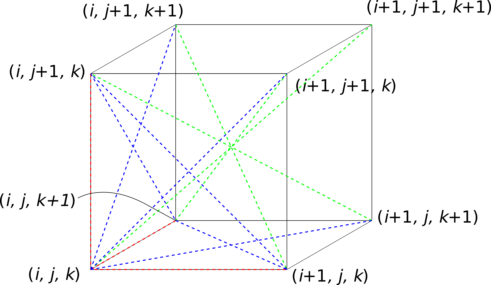

# Pair List

* Red lines  
(i, j, k) - (i+1, j, k)  
(i, j, k) - (i, j+1, k)  
(i, j, k) - (i, j, k+1)  

* Green lines  
(i, j, k) - (i+1, j+1, k+1)  
(i+1, j, k) - (i, j+1, k+1)  
(i, j+1, k) - (i+1, j, k+1)  
(i, j, k+1) - (i+1, j+1, k)  

* Blue lines  
(i, j, k) - (i+1, j, k+1)  
(i, j, k+1) - (i+1, j, k)  
(i, j, k) - (i, j+1, k+1)  
(i, j+1, k) - (i, j, k+1)  
(i, j, k) - (i+1, j+1, k)  
(i, j+1, k) - (i+1, j, k)  

